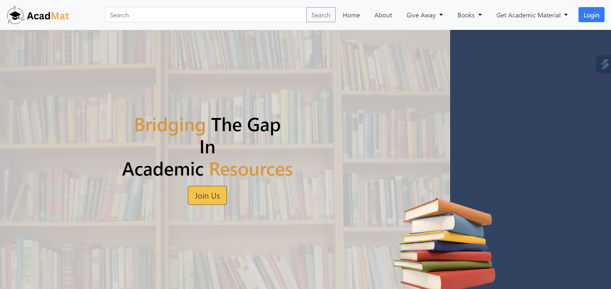

# ACADMAT - Bridging the Gap in Academic Resources

## Overview
ACADMAT is a web platform aimed at fostering resource sharing within the education sector. Our mission is to connect individuals who have surplus academic resources with those who need them the most. By repurposing unused items like books, school bags, uniforms, and other educational materials, we aim to make education more accessible and equitable for all learners.

## Project Features
- **Resource Listing:** Users can list their surplus academic resources for donation or selling at a lower price.
- **Resource Search:** Students in need can search for and request the resources they require.
- **Real-time Communication:** Utilizing Django MVT structure, our platform enables real-time communication between donors and recipients.

## Tech Stack
- Front-end: HTML, CSS, JavaScript
- Back-end: Python, Django
- Real-time Communication: Django
- Database: SQL

